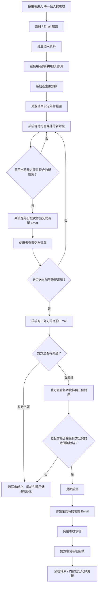
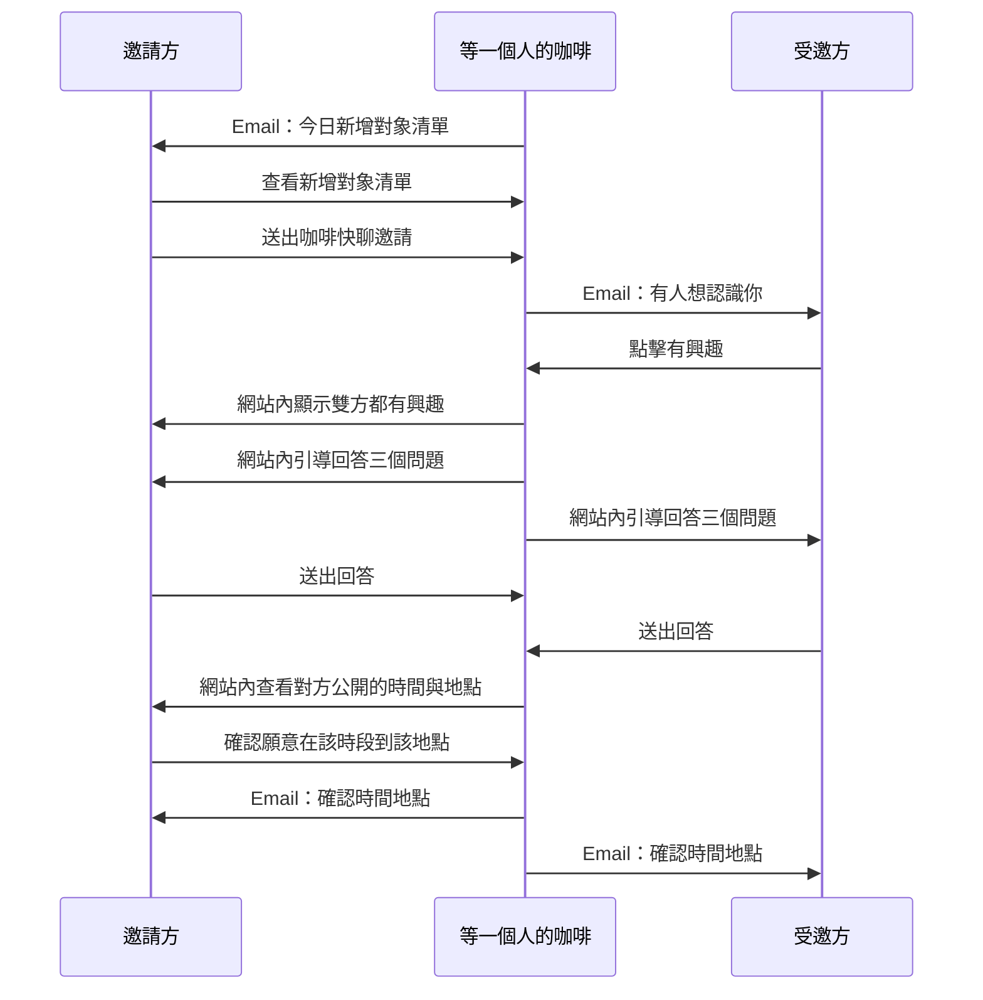

# 等一個人的咖啡 PRD

## 1. 專案概述

### 1.1 專案名稱

等一個人的咖啡

### 1.2 產品一句話

等一個人的咖啡是一個用 Email 推動流程、以柔焦照片與三個問題降低外貌篩選，並協助雙方在安全公開地點完成第一次約 1 小時咖啡快聊的交友網頁服務。

### 1.3 核心定位

等一個人的咖啡不是傳統滑照片的交友 App，也不是即時聊天軟體。它的核心價值是幫兩個互相有興趣的人，在安全、公開、低壓力的條件下，完成第一次真實見面。

### 1.4 目標使用者

- 不想每天滑交友 App 的人
- 厭倦長時間線上聊天、最後卻見不到面的人
- 想認真認識新朋友或潛在交往對象的人
- 願意在公開場所用一杯咖啡快速確認感覺的人
- 初期可先鎖定台北 / 新北 28-42 歲上班族

### 1.5 產品原則

- 以真實見面為核心，不鼓勵長時間站內聊天。
- 照片只輔助確認大致感覺，不作為主要篩選依據。
- 使用者不需要每天開網站，主要流程由 Email 推動。
- 新對象出現時，由系統依照雙方條件篩選後主動寄送推薦，避免產品變成無止境滑照片。
- 第一次見面必須在公開、明亮、人多、交通方便的場所。
- 平台不鼓勵太早交換 LINE，以保留基本安全控管。
- 拒絕、未成立、取消等狀態要用低傷害文案處理。

## 2. 問題與機會

### 2.1 使用者痛點

- 傳統交友 App 過度依賴照片，容易造成外貌篩選與照騙問題。
- 無止境滑照片容易讓使用者快速疲乏，也讓產品價值退化成只看外表。
- 長時間聊天成本高，但實際見面率低。
- 很多人想認識新對象，但不想投入太多滑卡、聊天與經營成本。
- 第一次見面常有安全、地點、時間、尷尬程度等疑慮。
- 太早交換 LINE 可能導致騷擾、推銷、詐騙與失控互動。

### 2.2 產品機會

等一個人的咖啡可以用「條件符合才 Email 推薦 + 柔焦照片 + 三個問題 + 公開地點 + 約 1 小時快聊」重新定義第一次認識流程。它不追求讓使用者在平台上停留很久，也不鼓勵使用者一直滑照片，而是讓合適的新對象出現時，由系統推動使用者做出簡單、低壓力的判斷。

## 3. MVP Scope

### 3.1 MVP 必做功能

1. 使用者註冊與 Email 驗證
2. 建立與編輯個人資料
3. 在使用者資料中匯入照片並產生柔焦版本
4. 在交友清單設定年齡篩選
5. 系統每日整理交友清單 Email
6. 瀏覽交友清單候選人
7. 發出咖啡快聊邀請
8. 我的咖啡邀約狀態頁
9. Email 通知邀請與流程狀態
10. 雙方有興趣後回答三個問題
11. 依接受方資料確認時間與地點
12. 見面成立通知
13. 見面後私密評價
14. 檢舉與封鎖
15. 簡易後台查看使用者、配對、邀請、評價與檢舉

### 3.2 MVP 不做功能

- 手機 App
- 即時聊天
- LINE 整合
- 付款系統
- 訂閱制
- AI 配對
- 高清照片解鎖
- 複雜地點資料庫
- 自動判斷座位
- 全台展開

### 3.3 第一版成功指標

- 註冊到完成個人資料的完成率
- 交友清單 Email 開信率與點擊率
- 推薦對象被送出邀請或被略過的比例
- 送出邀請率
- 邀請被回應率
- 雙方回答三個問題的完成率
- 交友清單中，使用者是否願意依對方公開的時間與地點送出邀約
- 見面成立率
- 見面後回饋填寫率
- 檢舉、封鎖、取消與放鳥比例

## 4. 使用者角色

### 4.1 一般使用者

可以註冊、建立資料、瀏覽候選人、公開通常方便的時間與地點、送出或回應邀請、查看見面資訊、填寫回饋、檢舉或封鎖他人。

### 4.2 管理員

可以查看使用者、照片審核狀態、邀請狀態、見面紀錄、回饋、檢舉與封鎖紀錄。MVP 後台以基本營運與安全處理為主。

## 5. 完整使用者流程

### 5.1 主流程

### 5.2 Email 驅動流程

## 6. 功能需求

### 6.1 註冊與驗證

- 使用者以 Email 註冊。
- MVP 可使用 magic link 或 Email OTP。
- Email 驗證成功後才可建立完整個人資料。
- 個人資料頁需顯示 Email 認證狀態，並提供寄送認證信或重新寄送認證信的操作。
- 所有關鍵操作連結需有期限，建議 72 小時。

### 6.2 個人資料

使用者需要填寫：

- 暱稱
- 性別
- 出生年月日
- 城市
- 行政區，依城市以下拉選單選擇
- 簡短自介，最多 300 字
- 通常方便時間，可用快捷標籤帶入時間補充欄
- 時間補充，使用者可自行修改
- 方便見面地點，使用 Google Maps 快捷搜尋按鈕輔助選點，作為使用者的公開定位點，必填

### 6.3 照片

- 使用者最多可上傳 5 張原圖。
- 使用者在自己的資料編輯頁可看到原圖，方便確認照片是否正確。
- 對外預設只顯示柔焦版本。
- 不再區分多級模糊，MVP 統一使用輕柔焦。
- 原圖只供平台審核，不直接公開。
- 可顯示「已通過真人照片驗證」。
- 不做高清照片解鎖。

### 6.4 候選人瀏覽

等一個人的咖啡的預設體驗不是讓使用者一直滑照片，而是當系統發現新的合適對象時，主動用 Email 推薦給使用者。網站內可以保留候選人列表，但它應該是「查看推薦結果」與「管理已推薦對象」的輔助頁，而不是主要成癮式滑卡入口。

### 6.5 交友清單 Email

當新使用者完成個人資料與照片柔焦版本後，系統會檢查是否有其他使用者符合年齡篩選與基本條件。MVP 不需要每出現一位新對象就立即寄信，而是每天固定批次寄出「交友清單」。

交友清單的核心目的，是把當天所有符合條件的新對象整理成一封 Email，讓使用者不用每天打開網站，也不會被大量單封推薦信打擾。

推薦成立需至少符合：

- 對方符合自己的年齡範圍。
- 自己也符合對方的年齡範圍。
- 雙方未封鎖彼此。
- 雙方沒有尚未結束的相同邀請流程。
- 對方帳號狀態正常，且基本資料完整。
- 對方照片已產生柔焦版本；若啟用真人照片審核，需符合最低審核狀態。

交友清單 Email 內容應包含：

- 今日新增且符合條件的人數。
- 每位新對象的柔焦照片或柔和視覺提示。
- 每位新對象的年齡區間、大區域、簡短自介與想認識的關係類型。
- 一個主要按鈕：「查看今日新增對象」。

交友清單寄送規則：

- MVP 建議每天固定寄送一次，例如上午或晚上。
- 若當天沒有符合條件的新增對象，不寄送清單 Email。
- 同一位候選人不可重複推薦給同一位使用者，除非產品未來設計重新推薦規則。
- 使用者應可設定通知偏好，例如每日、每週摘要、暫停推薦。
- 若使用者長期不點擊交友清單 Email，可降低寄送頻率或改為週摘要。

推薦排序可先使用簡單規則：

1. 雙方地區接近程度
2. 年齡條件吻合程度
3. 資料完整度
4. 最近活躍或最近完成資料者
5. 過去未被推薦過者優先

MVP 不需要做複雜 AI 配對，但需要把「推薦紀錄」存下來，避免重複寄送、方便追蹤開信與點擊，也能觀察哪些推薦真的帶來邀請。

候選人卡片顯示：

- 柔焦照片
- 年齡區間
- 大區域
- 簡短自介
- 想認識的關係類型
- 「請對方喝杯咖啡」按鈕

不顯示：

- 精準地址
- 公司或住家位置
- LINE 或其他聯絡資訊
- 高清照片

### 6.6 咖啡快聊邀請

- 一方可向候選人送出邀請。
- 男生及女生每天最多發出 1 個咖啡邀約。
- 受邀方透過 Email 回應「有興趣」或「暫時不要」。
- 男生及女生收到邀約後會鎖定 24 小時，鎖定期間不能收到其他邀約，其他人也不能再對此人送出邀約。
- 收到邀約後的鎖定只限制「被邀約」，不限制使用者主動邀約別人；使用者仍可使用自己每天 1 次的主動邀約額度。
- 接受後進入「邀約中」，此時解除 24 小時鎖定，使用者可以再次被其他人邀約。
- 拒絕或 24 小時逾時未回覆後解除鎖定。
- 邀請過期後自動失效。
- 對方拒絕時，邀請方只看到「這次沒有成立」。
- 文案建議：「第一次見面由邀請方負擔咖啡，作為基本禮貌與誠意。」

### 6.7 我的咖啡邀約

使用者需要一個頁面追蹤自己所有咖啡邀約狀態。MVP 可先用狀態分頁呈現：

- 全部
- 已邀約：已送出邀約，等待對方回應
- 邀約中：雙方已有互動，等待下一步確認
- 已完成：已完成咖啡見面，可填寫回饋
- 已取消：對方拒絕、逾期、取消或這次沒有成立

邀約卡片顯示：

- 對方柔焦照片
- 對方暱稱
- 狀態
- 方便時間
- 見面地點
- 下一步按鈕，例如查看邀約、查看進度、填寫回饋、查看結果

### 6.8 三個問題

雙方都有興趣後，需要回答三個簡短問題。MVP 預設題目：

1. 你最近週末通常怎麼過？
2. 你希望第一次見面聊輕鬆一點，還是認真一點？
3. 你目前是想認識朋友、曖昧、穩定交往，還是不確定？

回答完成後，雙方可查看對方回答，並選擇「願意安排」或「不適合」。

### 6.9 見面時間與地點

MVP 先不做複雜的時間與地點投票。每位使用者在個人資料中先公開「通常方便時間」與「方便見面地點」。交友清單會直接顯示這些資訊。

發起規則：

- 想約對方的人，按下「請對方喝杯咖啡」時，代表願意在對方公開的時段與地點赴約。
- 接受方不需要一開始再挑一輪地點，因為地點已在資料中先說明。
- 地點選擇 MVP 不串 Google Places API，而是提供 Google Maps 快捷搜尋按鈕，例如全家、7-11、Starbucks、Louisa、咖啡店。
- 使用者可先在同一欄填區域或地標，例如板橋車站、台中勤美、台北信義，再按快捷按鈕開啟 Google Maps。
- 使用者在 Google Maps 選好公開店點後，回到網站把店名貼回欄位，例如全家便利商店 中和中環店。
- MVP 先只提供一個方便見面地點，讓流程保持簡單；此欄也作為使用者的公開定位點。
- 可選類型包含商圈、車站、百貨商場、連鎖咖啡店與便利商店座位區。
- 地點只顯示公開區域或商圈，例如台中勤美附近、台北信義區、板橋車站附近，不顯示住家或公司精準位置。
- 確認成立後，雙方再看到更明確的公開店點或地圖連結。
- 若發起方不方便對方公開的時間或地點，就不要送出邀請，或等未來版本提供重新協調功能。

### 6.10 時間選擇

MVP 的時間選擇先放在個人資料中，不另外做雙方時段投票。每個人可以選擇自己通常方便的時間，並用補充文字說明更精準的時間範圍。

預設第一次見面約 1 小時，讓雙方有足夠時間暖場、聊天與判斷感覺。

範例時段：

- 今天 19:00-20:00
- 明天 12:30-13:30
- 明天 19:30-20:30
- 週六 15:00-16:00
- 週日 16:00-17:00

### 6.11 見面成立與確認時間地點

當接受方接受邀約，且發起方確認願意依對方公開的時間與地點赴約，系統會成立見面，並寄出「確認時間地點」Email。

確認時間地點 Email 包含：

- 日期
- 時間
- 地點
- 地址
- Google Maps 連結
- 公開場所提醒
- 約 1 小時低壓力提醒，若感到不舒服可提前結束
- 如感到不舒服可離開的安全提醒

見面前提醒可作為後續增強功能，不列入 MVP 三大 Email 功能：

- 24 小時前提醒
- 2 小時前提醒
- 可包含「我會準時」、「我會晚 5 分鐘」、「取消」

### 6.12 見面後回饋

回饋不公開、不做星等、不做外貌評分，只作為平台內部安全與信任分使用。

回饋項目：

- 是否見到本人
- 是否準時
- 是否有禮貌
- 是否讓你感到安全
- 是否有推銷、騷擾、冒犯
- 是否願意再聯絡
- 是否需要檢舉或封鎖

### 6.13 後台

MVP 後台需要支援：

- 查看使用者列表與狀態
- 查看個人資料與照片審核狀態
- 查看邀請狀態
- 查看見面紀錄
- 查看回饋摘要
- 查看檢舉與封鎖紀錄
- 標記使用者狀態，例如正常、限制、停權

## 7. Email 功能與文案原則

### 7.1 MVP 主要 Email 功能

MVP 的 Email 不需要拆成太多節點，先聚焦三個主要功能：

| 功能 | 目的 | 主要行動 |
| --- | --- | --- |
| 新的清單 | 每天寄出當天所有新增且符合條件的對象 | 查看今日新增對象 |
| 對方的邀約 | 通知有人想跟你咖啡快聊，並讓你回應是否有興趣 | 查看邀約 |
| 確認時間地點 | 發起方接受對方公開的時間與地點後，寄出最終見面資訊 | 查看見面資訊 |

### 7.2 三種 Email 的內容

#### 新的清單

- 每天最多寄一封。
- 內容是今天所有新增且符合雙方條件的對象。
- Email 內可以顯示簡短摘要，但主要行動應導回網站查看完整清單。
- 若今天沒有新增且符合條件的對象，則不寄送。

#### 對方的邀約

- 當某位使用者從交友清單中送出咖啡快聊邀請時，寄給受邀方。
- Email 內容不應暴露太多邀請方資訊，只提供柔焦照片、年齡區間、大區域與簡短介紹。
- Email 需明確告知：收到邀約後，其他人 24 小時內無法再邀約自己；但自己仍然可以主動邀約其他人。
- 主要行動是查看邀約，進入網站後再決定「有興趣」或「暫時不要」。
- 對方拒絕時，不寄出帶有羞辱感的拒絕通知，只在必要時顯示「這次沒有成立」。

#### 確認時間地點

- 當發起方接受對方公開的時間與地點，且對方也接受邀約後寄出。
- Email 包含日期、時間、地點、地址、Google Maps 連結與安全提醒。
- Email 需說明：邀約成立後可再次收到其他人的邀約；自己也一直可以主動邀約其他人。
- 這封信是見面前最重要的確認信，內容要清楚、簡短、可保存。

### 7.3 延後處理的 Email

以下 Email 不列入 MVP 核心三功能，可在第一版穩定後再補：

- 雙方都有興趣後的問題提醒
- 對方已回答問題提醒
- 選地點提醒
- 選時間提醒
- 見面前 24 小時提醒
- 見面前 2 小時提醒
- 見面後回饋提醒

MVP 可以先在網站內完成這些步驟，或在「對方的邀約」與「確認時間地點」兩種 Email 中承接必要動作。

### 7.4 Email 原則

- 每封信只放一個主要行動按鈕。
- 連結需有期限，建議 72 小時。
- 不在 Email 中暴露太多對方資訊。
- 拒絕時不寫「你被拒絕了」，只寫「這次沒有成立」。
- 需提供退訂與通知偏好。
- MVP 先不做簡訊，重要通知未來可補。

## 8. 第一版資料庫設計

以下為 MVP 建議資料表。實作時可依使用 Supabase Auth、NextAuth 或自建驗證調整 users 表。

### 8.1 users

| 欄位 | 型別 | 說明 |
| --- | --- | --- |
| id | uuid | 主鍵 |
| email | text | 使用者 Email，唯一 |
| email_verified_at | timestamptz | Email 驗證時間 |
| created_at | timestamptz | 建立時間 |
| status | text | normal、limited、suspended |

### 8.2 profiles

| 欄位 | 型別 | 說明 |
| --- | --- | --- |
| id | uuid | 主鍵 |
| user_id | uuid | 對應 users.id |
| nickname | text | 暱稱 |
| gender | text | 性別 |
| birth_year | int | 出生年 |
| birth_month | int | 出生月 |
| birth_day | int | 出生日 |
| city | text | 城市 |
| district | text | 行政區，依城市選單取得 |
| intro | text | 簡短自介，最多 300 字 |
| availability_note | text | 通常方便時間與補充，例如平日晚上、週六下午，平日 19:30 後 |
| meeting_place | text | 方便見面地點或公開店名，必填，例如全家便利商店 中和中環店 |
| meeting_google_place_id | text | Google Place ID，MVP 不使用，可留給正式串接 |
| looking_for | text | 想認識的關係類型 |
| created_at | timestamptz | 建立時間 |
| updated_at | timestamptz | 更新時間 |

### 8.3 photos

| 欄位 | 型別 | 說明 |
| --- | --- | --- |
| id | uuid | 主鍵 |
| user_id | uuid | 對應 users.id |
| original_url | text | 原圖網址 |
| soft_url | text | 柔焦圖網址 |
| verification_status | text | pending、approved、rejected |
| created_at | timestamptz | 建立時間 |

### 8.4 preferences

| 欄位 | 型別 | 說明 |
| --- | --- | --- |
| id | uuid | 主鍵 |
| user_id | uuid | 對應 users.id |
| min_age | int | 最小年齡 |
| max_age | int | 最大年齡 |
| recommendation_frequency | text | 每日、每週摘要、暫停 |
| updated_at | timestamptz | 更新時間 |

### 8.5 candidate_recommendations

| 欄位 | 型別 | 說明 |
| --- | --- | --- |
| id | uuid | 主鍵 |
| user_id | uuid | 收到推薦的使用者 |
| candidate_user_id | uuid | 被推薦的新對象 |
| digest_date | date | 歸屬哪一天的交友清單 |
| email_batch_id | uuid | 同一封交友清單 Email 的批次 ID |
| status | text | sent、opened、clicked、invited、skipped、expired |
| match_reason | jsonb | 推薦原因，例如地區、年齡、偏好符合 |
| email_sent_at | timestamptz | 交友清單 Email 寄送時間 |
| opened_at | timestamptz | 開信時間，可為空 |
| clicked_at | timestamptz | 點擊時間，可為空 |
| created_at | timestamptz | 建立時間 |
| expires_at | timestamptz | 推薦有效期限 |

### 8.6 coffee_invites

| 欄位 | 型別 | 說明 |
| --- | --- | --- |
| id | uuid | 主鍵 |
| sender_user_id | uuid | 邀請方 |
| receiver_user_id | uuid | 受邀方 |
| recommendation_id | uuid | 來源推薦紀錄，可為空 |
| status | text | pending、interested、declined、questions、arranging、matched、expired、cancelled |
| created_at | timestamptz | 建立時間 |
| expires_at | timestamptz | 過期時間 |

### 8.7 question_answers

| 欄位 | 型別 | 說明 |
| --- | --- | --- |
| id | uuid | 主鍵 |
| invite_id | uuid | 對應 coffee_invites.id |
| user_id | uuid | 回答者 |
| question_key | text | 題目代碼 |
| answer | text | 回答 |
| created_at | timestamptz | 建立時間 |

### 8.8 place_options（後續版本）

| 欄位 | 型別 | 說明 |
| --- | --- | --- |
| id | uuid | 主鍵 |
| invite_id | uuid | 對應 coffee_invites.id |
| place_name | text | 店名 |
| address | text | 地址 |
| google_place_id | text | Google Place ID |
| lat | numeric | 緯度 |
| lng | numeric | 經度 |
| map_url | text | 地圖連結 |
| created_at | timestamptz | 建立時間 |

### 8.9 place_votes（後續版本）

| 欄位 | 型別 | 說明 |
| --- | --- | --- |
| id | uuid | 主鍵 |
| invite_id | uuid | 對應 coffee_invites.id |
| user_id | uuid | 投票者 |
| place_option_id | uuid | 對應 place_options.id |
| accepted | boolean | 是否接受 |
| created_at | timestamptz | 建立時間 |

### 8.10 time_options（後續版本）

| 欄位 | 型別 | 說明 |
| --- | --- | --- |
| id | uuid | 主鍵 |
| invite_id | uuid | 對應 coffee_invites.id |
| start_time | timestamptz | 開始時間 |
| end_time | timestamptz | 結束時間 |
| created_at | timestamptz | 建立時間 |

### 8.11 time_votes（後續版本）

| 欄位 | 型別 | 說明 |
| --- | --- | --- |
| id | uuid | 主鍵 |
| invite_id | uuid | 對應 coffee_invites.id |
| user_id | uuid | 投票者 |
| time_option_id | uuid | 對應 time_options.id |
| accepted | boolean | 是否接受 |
| created_at | timestamptz | 建立時間 |

### 8.12 meetings

| 欄位 | 型別 | 說明 |
| --- | --- | --- |
| id | uuid | 主鍵 |
| invite_id | uuid | 對應 coffee_invites.id |
| place_option_id | uuid | 成立地點 |
| time_option_id | uuid | 成立時段 |
| status | text | scheduled、completed、cancelled、no_show |
| created_at | timestamptz | 建立時間 |
| cancelled_at | timestamptz | 取消時間 |

### 8.13 feedback

| 欄位 | 型別 | 說明 |
| --- | --- | --- |
| id | uuid | 主鍵 |
| meeting_id | uuid | 對應 meetings.id |
| reviewer_user_id | uuid | 評價者 |
| reviewed_user_id | uuid | 被評價者 |
| showed_up | boolean | 是否出現 |
| on_time | boolean | 是否準時 |
| polite | boolean | 是否有禮貌 |
| felt_safe | boolean | 是否讓人感到安全 |
| wants_contact | boolean | 是否願意再聯絡 |
| report_reason | text | 問題描述 |
| created_at | timestamptz | 建立時間 |

### 8.14 blocks

| 欄位 | 型別 | 說明 |
| --- | --- | --- |
| id | uuid | 主鍵 |
| blocker_user_id | uuid | 封鎖者 |
| blocked_user_id | uuid | 被封鎖者 |
| created_at | timestamptz | 建立時間 |

### 8.15 reports

| 欄位 | 型別 | 說明 |
| --- | --- | --- |
| id | uuid | 主鍵 |
| reporter_user_id | uuid | 檢舉者 |
| reported_user_id | uuid | 被檢舉者 |
| meeting_id | uuid | 相關見面，可為空 |
| reason | text | 檢舉原因 |
| details | text | 詳細描述 |
| status | text | open、reviewing、resolved、dismissed |
| created_at | timestamptz | 建立時間 |

## 9. 建議技術架構

### 9.1 前端

- Next.js
- React
- Tailwind CSS 或既有設計系統

### 9.2 後端

- Next.js API routes 或 Route Handlers
- Node.js 背景任務處理交友清單、邀約 Email 與時間地點確認 Email

### 9.3 資料庫

- PostgreSQL
- 可使用 Supabase 或 Railway

### 9.4 驗證

- Email magic link 或 Email OTP
- MVP 建議使用 Supabase Auth 或 Auth.js 搭配 Email provider

### 9.5 圖片儲存與處理

- Cloudflare R2 或 AWS S3
- 上傳後產生：
  - 原圖
  - 柔焦圖

### 9.6 Email

- Resend、SendGrid 或 AWS SES
- MVP 建議優先使用 Resend，整合簡單且適合交易型 Email

### 9.7 地點搜尋

- Google Maps Places API
- MVP 只需要查詢公開地點，不需要建立完整地點資料庫

### 9.8 部署

- Vercel + Supabase
- 或 Vercel + Railway PostgreSQL

## 10. 第一階段開發順序

### Phase 0：專案基礎

1. 建立 Next.js 專案
2. 設定 TypeScript、Lint、格式化工具
3. 建立基本版型與導覽
4. 設定環境變數管理
5. 建立資料庫連線與 migration 流程

### Phase 1：帳號與個人資料

1. Email 註冊與驗證
2. 建立 profiles 與交友清單年齡篩選
3. 個人資料建立與編輯頁
4. 基本資料完整度檢查

### Phase 2：照片與候選人

1. 圖片上傳
2. 產生柔焦版
3. 建立年齡範圍篩選邏輯
4. 建立 candidate_recommendations
5. 交友清單 Email
6. 推薦候選人頁與邀請按鈕
7. 封鎖者與被封鎖者排除邏輯

### Phase 3：邀請與 Email

1. 建立 coffee_invites
2. 從推薦對象送出邀請
3. 發送「對方的邀約」Email
4. Email link token 與期限
5. 受邀方回應有興趣 / 暫時不要
6. 邀請狀態更新與低傷害通知

### Phase 4：三個問題

1. 問題回答頁
2. 查看對方回答頁
3. 願意安排 / 不適合
4. 雙方都願意後進入安排流程

### Phase 5：時間地點確認

1. 在個人資料中顯示對方公開的方便時間與地點
2. 發起方確認願意在該時段與地點赴約
3. 建立 meeting
4. 發送確認時間地點 Email
5. Google Maps Places API 與重新協調功能留到後續版本

### Phase 6：時間地點確認與回饋

1. 見面後回饋表單
2. 檢舉與封鎖
3. 內部信任紀錄更新
4. 見面前提醒可作為後續增強功能

### Phase 7：簡易後台

1. 管理員登入或權限判斷
2. 使用者列表
3. 邀請與見面列表
4. 回饋列表
5. 檢舉與封鎖列表
6. 使用者狀態調整

## 11. 產品風險與對策

| 風險 | 影響 | MVP 對策 |
| --- | --- | --- |
| 冷啟動困難 | 同區域候選人不足 | 初期限定台北 / 新北特定族群，手動邀請種子使用者 |
| 女性安全感不足 | 影響接受度與留存 | 公開地點、不顯示精準位置、見面提醒、檢舉封鎖、內部信任分 |
| 咖啡邀請文案被誤解 | 造成反感 | 使用「基本禮貌與誠意」，避免購買女性時間的語氣 |
| Email 被忽略 | 流程中斷 | 標題清楚、每封信單一 CTA、提醒機制 |
| 放鳥與臨時取消 | 信任下降 | 會準時 / 晚到 / 取消按鈕，見面後回饋納入內部紀錄 |
| 騷擾、推銷、詐騙 | 安全與品牌風險 | 不做即時聊天、不太早交換 LINE、檢舉封鎖與後台審核 |
| 地點品質不穩 | 見面體驗不佳 | 初期只允許填寫公開商圈與公開店名，不顯示私人地址 |

## 12. 初期驗證問題

1. 男生是否願意用一杯咖啡邀請女生快聊？
2. 女生是否願意接受柔焦照片、三個問題、公開地點快聊？
3. 雙方是否覺得這比一般交友 App 更有效率？
4. 使用者是否接受不用 App、靠 Email 推動流程？
5. 使用者是否接受「對方公開時間地點，發起方願意就赴約」的簡化流程？
6. 見面後是否願意填回饋？

## 13. 下一步建議

第一個可執行里程碑建議是建立「帳號 + 個人資料 + 年齡範圍篩選 + 交友清單 Email + 發出邀請」的窄版流程。這個版本先驗證使用者是否接受不用一直滑照片，而是每天收到一封整理好的交友清單，並觀察他們是否願意依對方公開的時間與地點送出或回應咖啡邀請。

